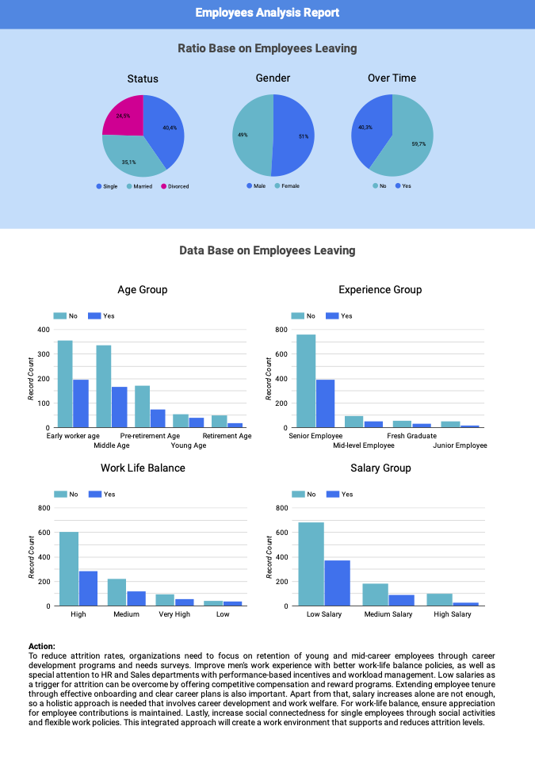
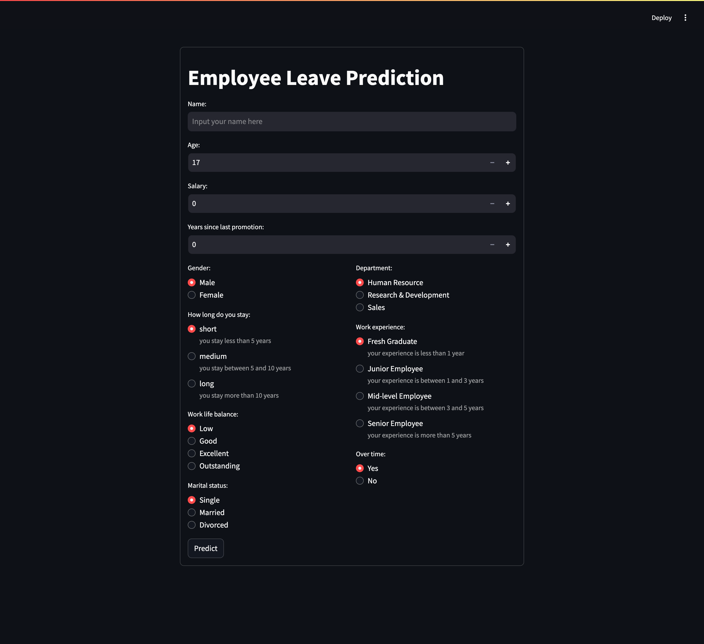

# Proyek Akhir: Menyelesaikan Permasalahan Perusahaan Edutech

## Business Understanding

Attrition is one of the major challenges faced by companies.
High attrition rates can lead to additional costs such as recruitment, training, and decreased productivity.
By analyzing the factors that influence attrition, companies can identify the root causes and take steps to reduce employee turnover rates.


### Permasalahan Bisnis

Some business questions that need to be answered are:

1. Are certain age groups more susceptible to attrition?
2. Does gender affect attrition patterns?
3. Which departments have the highest attrition rates, and why?
4. Do low salaries make employees more likely to leave?
5. How long does an employee stay with a company on average?
6. Is there a relationship between salary increases/bonuses and employee retention rates?
7. Do long or short working hours affect employees’ decisions to leave?
8. Do married groups have higher attrition rates?
9. How can we predict which employees are likely to leave in the future?

### Cakupan Proyek

1. Attrition Data Analysis
<p>Collect historical data related to:</p>

- Age, gender, department, salary, length of service, raise/bonus, working hours, and attrition status.
- Identify patterns and correlations among these variables.

2. Measurement and Evaluation

- Calculate attrition rates based on age group, gender, department, salary level, and more.
- Determine the average length of time an employee works before leaving.

3. Prediction Model

- Build a machine learning model to predict potential future employee attrition based on historical patterns.
- Provide recommendations to improve retention based on model predictions.

4. Strategic Recommendations

- Provide recommendations to management to reduce attrition rates through policies such as salary increases,
bonuses, flexible working hours, or job satisfaction programs.

### Persiapan

Data source: <a href="https://github.com/dicodingacademy/dicoding_dataset/blob/main/employee/employee_data.csv?raw=true">Link Dataset</a>

Setup environment:

```bash
conda create -n myenv
conda activate myenv
pip install -r requirements.txt
```

## Business Dashboard


<a href="https://lookerstudio.google.com/reporting/20abbeb8-00c6-4b5c-a080-979679ec415e">Link Dashboard</a>

## Model Prediciton


<a href="https://human-resource-problem-analysis-jcjgcvxckb2f32ewqfhryg.streamlit.app/">Link Streamlit</a>

How to run in local:

```bash
streamlit run app.py
```

note:You must install requirements first

## Conclusion
1. Do certain age groups have higher attrition rates?
- The analysis shows that employees in the early career age group and the middle-aged group tend to have higher attrition rates than other age groups. This suggests that young employees and those in the middle of their careers may face challenges or dissatisfaction that cause them to leave the organization.
2. How do attrition rates vary by gender?
- The data shows that male employees have higher attrition rates than female employees.
This suggests that male employees may face different challenges or dissatisfaction that cause them to leave the organization.
3. Which department has the highest attrition rate?
- The data shows that the Research & Development department has slightly lower attrition than the Human Resources and Sales departments. However, the difference is relatively small.
4. Is attrition higher among lower-paid employees?
- The data shows that low-paid employees are more likely to leave their jobs (attrition) than middle- or high-paid employees. 5. How long do employees stay with the company on average before they experience attrition?
- The data shows that short-tenured employees (less than 5 years of service) and recent graduates (less than 1 year of experience) are more likely to leave (experience attrition) than other groups.
6. How do attrition rates vary based on salary increases or bonuses
- The data shows that providing salary increases alone may not be an effective strategy to reduce employee attrition
7. How is attrition affected by average hours worked?
- The data shows that employees with excellent work-life balance and who do not work overtime are more likely to leave than other groups.
8. Are married groups attrition rates higher?
- The data shows that single employees are more likely to leave (attrition) than married or divorced employees.
9. How can we predict which employees are likely to leave in the future?
- Using the previously created ml model


### Rekomendasi Action Items
1. Focus on Young and Mid-Career Employee Retention

- Identify the needs of young and mid-career employees through regular surveys.
- Provide career development programs such as technical training, mentoring, and promotion opportunities.
- Introduce clear career paths to motivate employees to stay with the organization longer.

2. Work Experience for Men

- Implement work-life balance policies, such as flexible working hours or work-from-home options.
- Evaluate the needs of male employees periodically to ensure policies are relevant and effective.

3. HR and Sales Departments

- Implement performance-based incentives, such as bonuses or awards for achieving targets.
- Conduct regular workload audits to reduce the potential for burnout in these two departments.
- Create a support team to help handle administrative tasks so that employees can focus on key priorities.

4. Low Salary Issues as a Trigger for Attrition

- Offer competitive compensation according to market standards.
- Introduce reward programs, such as performance bonuses, long-service awards, or additional benefits (e.g. health, education).

5. Effective Onboarding and Clear Career Plans

- Provide a comprehensive orientation program to help new employees understand the culture and goals of the organization.
- Offer a transparent career plan with regular evaluation of employee progress.
- Provide soft skills training to improve employees’ interpersonal and managerial skills.

6. Holistic Approach to Career Development and Workplace Well-Being

- Enhance mental well-being by providing counseling or access to psychological services.
- Conduct regular feedback sessions to listen to employees’ needs and show appreciation for their contributions.
- Design individual development programs that allow employees to explore interests outside of their primary job.

7. Work-Life Balance

- Provide adequate breaks, such as extra leave or schedule flexibility during busy days.
- Reward employee achievements through public recognition or other incentives.

8. Social Connectedness for Single Employees

- Host social activities such as outings, workshops, or hobby communities within the company.
- Provide flexible work policies to help single employees feel more connected to the work community.

Create a buddy system program to create stronger working relationships among employees.
With this approach, organizations can create a more supportive work environment, increase employee retention, and reduce attrition rates.

